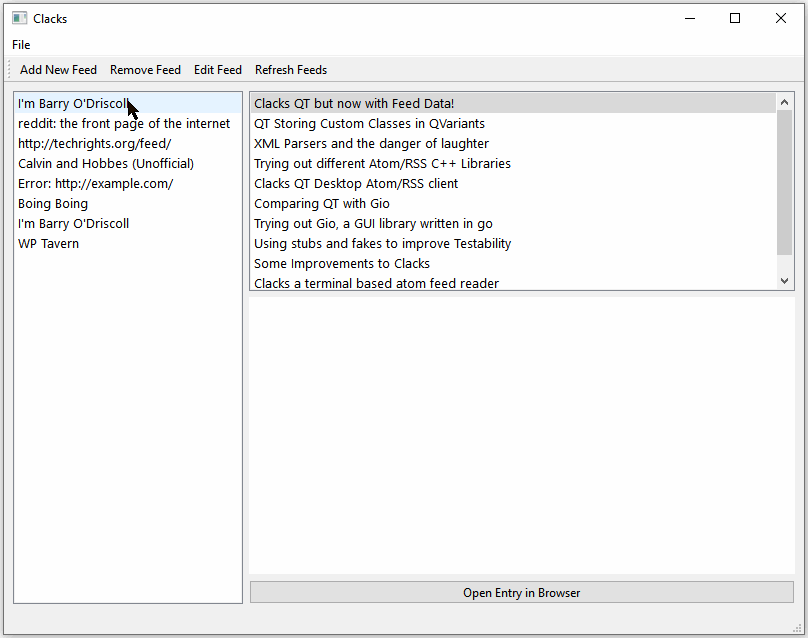

# ClacksQt
A minimal windows desktop RSS/Atom reader built with Qt.

## Demo

## Dependiences
- [SQLite](https://www.sqlite.org/index.html) - to store feeds
- [Qt 6.2](https://www.qt.io/) - to provide GUI, downloading feeds, xml parsing and misc utilites mutexes
- [Chromium](https://www.chromium.org/) - embedded to display html of feed entries

## Alternatives
- [RSS Guard](https://github.com/martinrotter/rssguard) - RSS Guard is a fully fledged desktop app that does everything under the sun. I like to think of Clacks as it's little brother.

